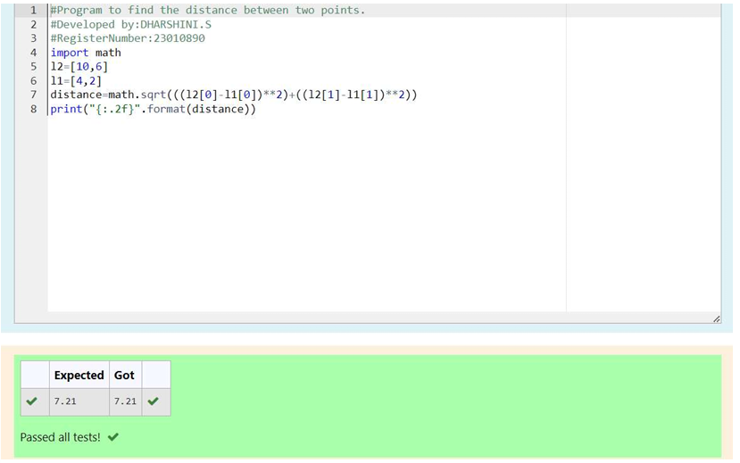

# DISTANCE-BETWEEN-TWO-POINTS

## AIM:
To write a python program to find the distance two 2 points
## ALGORITHM:
### Step 1:
Get the values from the user 
### Step 2: 
Type the program
### Step 3: 
Substitute the values in the distance formula  
### Step 4:
Print the distance between two points 
### Step 5:
End the program 
### PROGRAM:
 ```python
 #Program to find the distance between two points.
#Developed by:DHARSHINI.S 
#RegisterNumber:23010890
import math
l2=[10,6]
l1=[4,2]
distance=math.sqrt(((l2[0]-l1[0])**2)+((l2[1]-l1[1])**2))
print("{:.2f}".format(distance))
 ``` 


### OUTPUT:



### RESULT:
